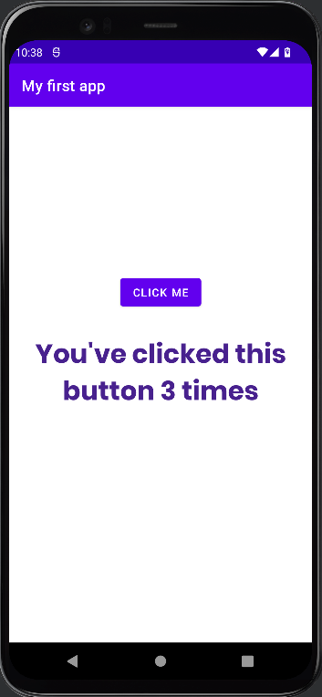
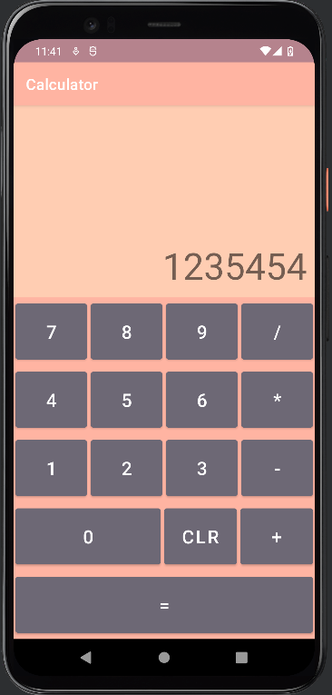
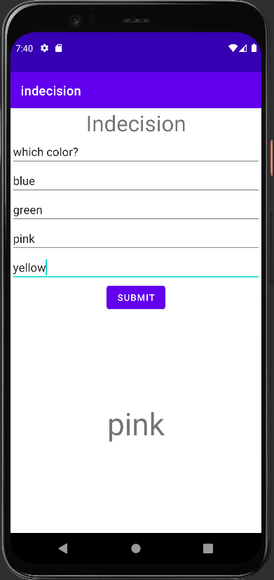

---Friday 2/18---

8:00 - 8:30 Begin kotlin youtube video and download android studio
https://www.youtube.com/watch?v=HwoxgUPabMk&t=19785s

8:30 - 9:30 Learn about android phone emulator in android studio

9:30 - 10:00 Learn about xml documents and a tiny bit about styling in android studio

10:00 - 10:45 create first app using kotlin (counts number of clicks on a button)

2 hours 45 min total

10:45 - 12:00 continue video at 1.75 speed as it goes through basic programming with kotlin (variable types, template literals, if else statements, while loops, and when loops(similar to switch statements))

12:00 - 1:00 Lunch break

1:00 - 2:00 continued video at fast speed learning about functions then studied a new subject, nullables, in kotlin

2:00 - 3:00 continued video at normal speed learning about classes in kotlin

3:00 - 4:00 continue learning about object oriented programming in kotlin

4 hours 15 min total

---Sunday 2/20---

3:00 - 4:30 Continued studying video learning about different class types in kotlin, interfaces, type casting, and started learning about kotlin collections. got to 5:30:00 of the video

1 hour 30 min total

---Friday 2/25---

1:00 - 1:20 add README.md and project proposal

1:20 - 2:20 continue video learning about more kotlin collections (lists, maps, ArrayLists) and lambda expressions

2:20 - 3:00 continue video learning about kotlin visibility modifiers

3:00 - 3:45 learned about nested and inner classes, safe casting, and exception handling with try & catch blocks

3:00 - 4:00 start studying UI coding in android studio

3 hours

---Saturday 2/26---

4:30 - 5:10 learn how to create UI with practice age calculator app

5:10 - 6:00 learn how to about Dialogs and how to change text in the UI using OnclickListener and onDateSetListener

6:00 - 6:30 finish following along to create age in minutes practice app

6:30 - 7:00 practice what I learned by adding age in Hours and age in years on my own

2 hours 30 min total

---Sunday 2/27---

9:40 - 10:30 Try to create UI on my own for second practice project. this was very difficult and I struggled to find good resources for complete beginners so I continued to watch the video and follow along.

10:30 - 11:10 Finish UI layout for practice calculator app and learn about linear layouts, layout weight, and orientation.

11:10 - 11:50 add functionality to display the number of the button clicked along with adding functionality to the clr button to clear the display

2 hours 10 min total

---Saturday 3/5---

12:00 - 1:00 Continue following along with video to adding functionality to the operator buttons and adding a decimal button. begin adding equal button functionality

5:30 - 6:00 finish adding functionality to the calculator app and finish video.

6:00 - 7:10 begin constructing a simple ui for app

7:10 - 7:40 create very basic app that just meets the MVP for project

3 hours 10 min total

---Sunday 3/6---

9:00 - 9:30 add function that removes keyboard from view after button is clicked

9:30 - 10:00 try to figure out how to add multiple pages to an app. didnt work

10:00 - 11:00 find and begin watching videos about android studio as I still am feeling very fuzzy on UI integration.

11:00 - 12:00 learn more about liner and constraint layouts

1:00 -2:00 learn more about UI integration and how to add images

2:00 - 3:00 continue learning about context in kotlin and more about XML activities

5 hours total

---Monday 3/7---

1:00 - 1:45 learn about adding more android Activity views to a project

1:45 - 2:30 learn about passing variables between activities

2:30 - 3:30 learn about permissions

2 hours 30 minutes total

---tuesday 3/8---

8:00 - 9:00 study adding firebase and start reorganising project

9:00 - 10:00 finish reorganising project and make all pages accessible

10:00 - 11:30 attempt to create a recycler view for question options. run into bug

1:00 - 2:00 try to fix implementing recycler view with no luck

2:30 - 3:30 get recycler view to work without delete functionality and add to QuestionFormActivity

3:30 - 4:20 add user authentication with firebase

6 hours 20 minutes total

---wednesday 3/9---

8:00 - 9:00 add questions to firestore

9:00 - 11:00 get firestore questions data and add to recycler view

11:00 -12:00 try to solve how to switch pages from recycler view buttons. work in progress

1:00 -2:30 figure out how to switch pages from recycler view

2:30 - 3:00 add remove functionality to form recycler view

3:00 - 3:30 update firebase on re-roll

3:30 - 4:30 create magic 8 ball activity

4:30 - 5:00 learn how to connect physical device to android studio for testing