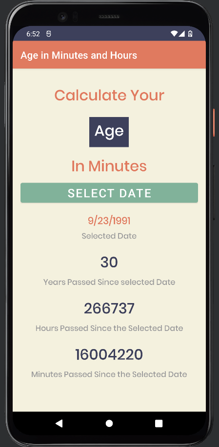

---Friday 2/18---

8:00 - 8:30 Begin kotlin youtube video and download android studio
https://www.youtube.com/watch?v=HwoxgUPabMk&t=19785s

8:30 - 9:30 Learn about android phone emulator in android studio

9:30 - 10:00 Learn about xml documents and a tiny bit about styling in android studio

10:00 - 10:45 create first app using kotlin (counts number of clicks on a button)

10:45 - 12:00 continue video at 1.75 speed as it goes through basic programming with kotlin (variable types, template literals, if else statements, while loops, and when loops(similar to switch statements))

12:00 - 1:00 Lunch break

1:00 - 2:00 continued video at fast speed learning about functions then studied a new subject, nullables, in kotlin

2:00 - 3:00 continued video at normal speed learning about classes in kotlin

3:00 - 4:00 continue learning about object oriented programming in kotlin

---Sunday 2/20---

3:00 - 4:30 Continued studying video learning about different class types in kotlin, interfaces, type casting, and started learning about kotlin collections. got to 5:30:00 of the video

---Friday 2/25---

1:00 - 1:20 add README.md and project proposal

1:20 - 2:20 continue video learning about more kotlin collections (lists, maps, ArrayLists) and lambda expressions

2:20 - 3:00 continue video learning about kotlin visibility modifiers

3:00 - 3:45 learned about nested and inner classes, safe casting, and exception handling with try & catch blocks

3:00 - 4:00 start studying UI coding in android studio

---Saturday 2/26---

4:30 - 5:10 learn how to create UI with practice age calculator app

5:10 - 6:00 learn how to about Dialogs and how to change text in the UI using OnclickListener and onDateSetListener

6:00 - 6:30 finish following along to create age in minutes practice app

6:30 - 7:00 practice what I learned by adding age in Hours and age in years on my own

---Sunday 2/27---

9:40 - 10:30 Try to create UI on my own for second practice project. this was very difficult and I struggled to find good resources for complete beginners so I continued to watch the video and follow along.

10:30 - 11:10 Finish UI layout for practice calculator app and learn about linear layouts, layout weight, and orientation.

