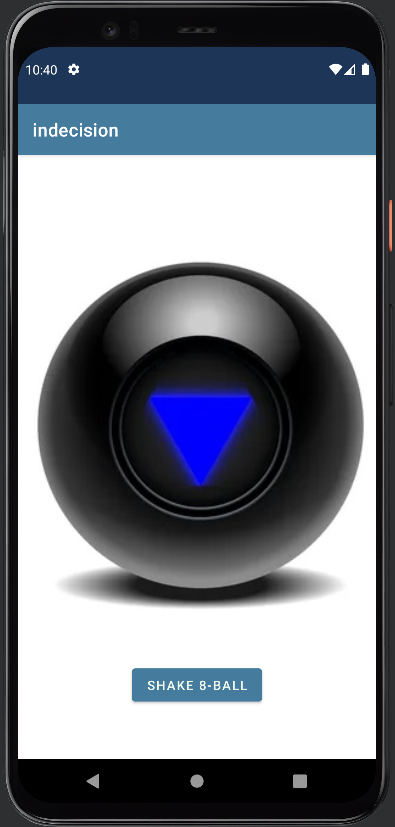

# _Indecision_  

#### By **Christina Welch**

#### _This was the final capstone project made for Epicodus School. It was made in android studio using kotlin._

 

 

## 💾 Technologies Used

* Kotlin
* Android Studio
* XML
* Google Firebase

 

## 💻 Description

_A final capstone project made for Epicodus school. I studied kotlin and android studio for a week on my own and created an app with firebase integration._
 
_If you have a hard time making decisions this is the app for you. Add a question with as many possible outcomes as you'd like and the app will randomise an answer for you. create an account to re roll past decisions or use the magic 8 ball for yes or no questions._

 

## ⚙️ Setup

* download android studio [here](https://developer.android.com/studio)
* Clone the GitHub repository: https://github.com/Christinamawel/indecision.git
* open android studio and select File > open... > and locate the cloned repository on your pc.
* click on device manager in top right corner
   
  
   
* click Create Device and choose a device from list then click next.(for this project pixel 4 was used)
* on the next page find R in the list and click the download link next to it. once finished downloading select it and click next.
   

   
* on the next page hit finish and your virtual device will be installed.
* from the dropdown menu on the toolbar select your new device and hit the play button.
   
  
   

 

## ❌ Known Bugs

- decisions are currently unable to be edited or deleted. 
- if you remove all items in the create Decision form you will be sent back to the home screen.

 

 

## 📃 License

MIT License

Copyright (c) [2022] [Christina Welch]